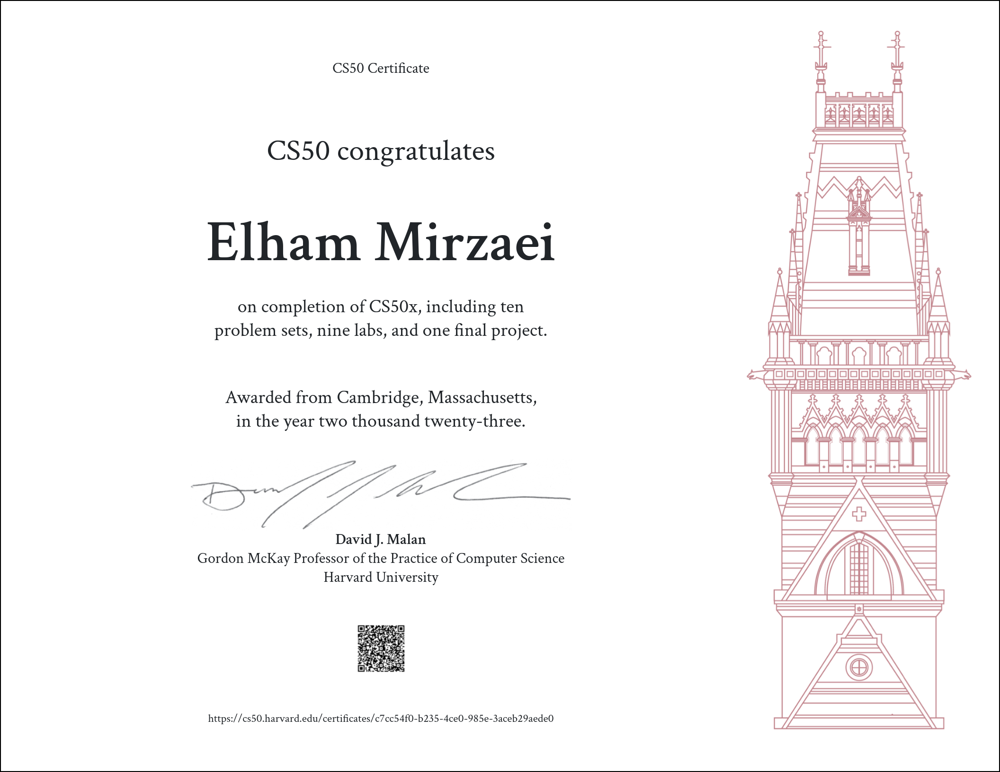

# CS50x 2023

 

    

<h1 align="center">
    Harvard CS50x — 2023
</h1>

  <a href="https://cs50.harvard.edu/x/2023/" target="_blank">Course Link</a>

#### *CS50’s Introduction to Computer Science*

Harvard University’s introduction to the intellectual enterprises of computer science and the art of programming.
This repository contains all of projects and files made for this course:
- [Week 0 Scratch](https://cs50.harvard.edu/x/2023/weeks/0/)
- [Week 1 C](https://cs50.harvard.edu/x/2023/weeks/1/)
- [Week 2 Arrays](https://cs50.harvard.edu/x/2023/weeks/2/)
- [Week 3 Algorithms](https://cs50.harvard.edu/x/2023/weeks/3/)
- [Week 4 Memory](https://cs50.harvard.edu/x/2023/weeks/4/)
- [Week 5 Data Structures](https://cs50.harvard.edu/x/2023/weeks/5/)
- [Week 6 Python](https://cs50.harvard.edu/x/2023/weeks/6/)
- [Week 7 SQL](https://cs50.harvard.edu/x/2023/weeks/7/)
- [Week 8 HTML, CSS, JavaScript](https://cs50.harvard.edu/x/2023/weeks/8/)
- [Week 9 Flask](https://cs50.harvard.edu/x/2023/weeks/9/)
- [Week 10 Emoji](https://cs50.harvard.edu/x/2023/weeks/10/)

  ## Certificate 

<pre align="center">
Finished on July 8th, 2023
</pre>

